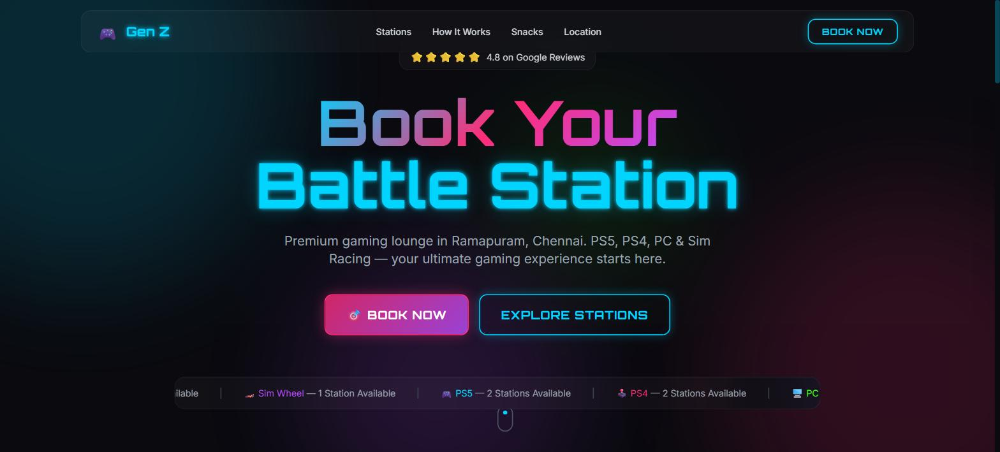
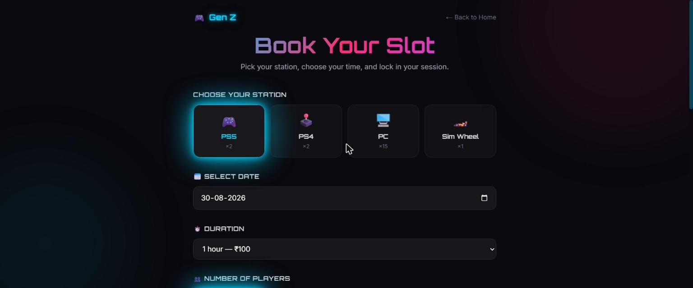
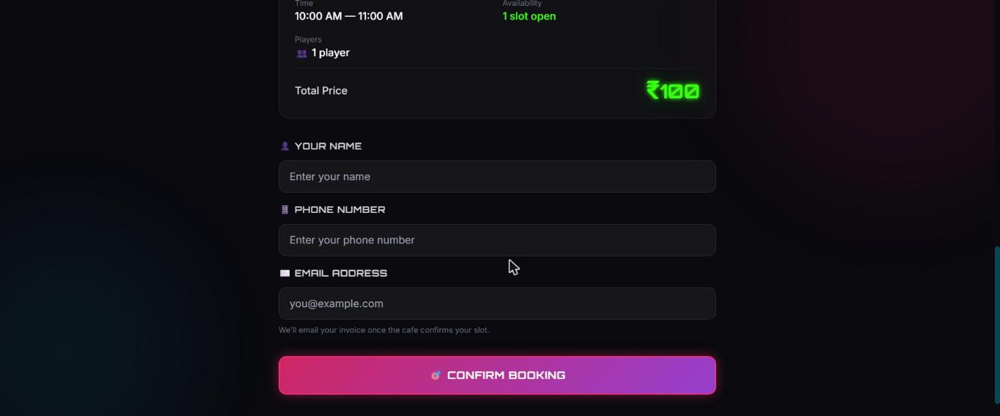
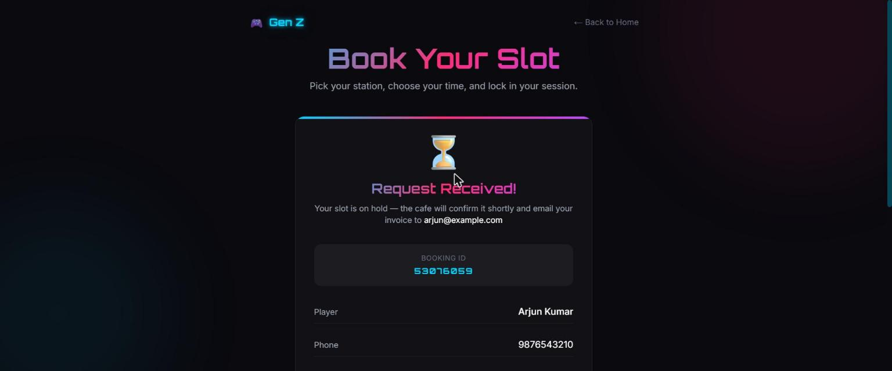
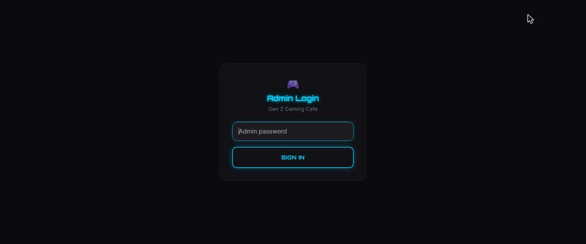
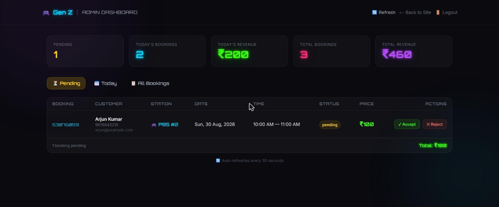
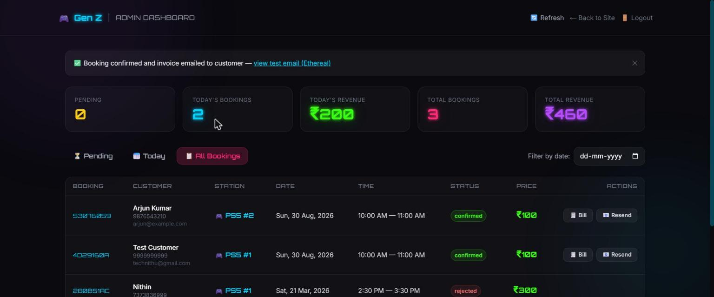
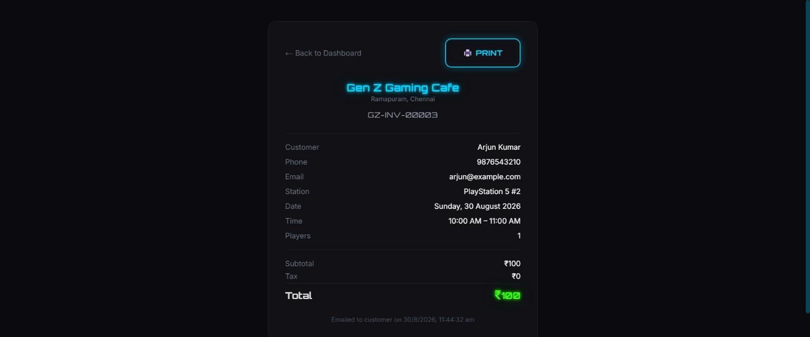

# Gen Z Gaming Cafe

A booking website and admin backend for a gaming cafe (PS5 / PS4 / PC / Sim Racing) in Ramapuram, Chennai — built with Next.js 14 (App Router), TypeScript, Tailwind CSS, and SQLite.

Customers pick a station and time slot on the public site; the request goes into a **pending** queue. The cafe owner reviews it from a password-protected **admin dashboard**, accepts or rejects it, and on accept the system auto-generates an invoice and emails it to the customer — all within seconds of clicking Accept.

## Screenshots

### Public site

**Home page**


**Booking form** — pick a station, date, duration and time slot


**Booking form** — session summary and customer details


**Booking confirmation** — request goes in as pending, awaiting cafe approval


### Admin dashboard

**Admin login**


**Pending requests** — accept or reject incoming bookings


**All bookings** — full history with status, bill and resend actions


**Invoice / bill** — auto-generated on accept, printable


## How it works

1. A customer submits the booking form on `/book` with name, phone, email, station, date, time and duration.
2. The slot is reserved immediately (so nobody else can double-book it) but the booking status is `pending`.
3. The cafe owner logs into `/admin` and sees pending requests in real time (dashboard auto-refreshes every 30s).
4. Clicking **Accept**:
   - marks the booking `confirmed`
   - generates an invoice (`bills` table, sequential invoice numbers like `GZ-INV-00001`)
   - emails the invoice to the customer via Nodemailer
5. Clicking **Reject** marks the booking `rejected`, frees the slot back up, and emails the customer.
6. The owner can reprint the invoice or resend the confirmation email at any time from **All Bookings**.

## Tech stack

- **Next.js 14** (App Router) + TypeScript
- **better-sqlite3** — local file-based database (`data/bookings.db`)
- **Nodemailer** — booking confirmation / rejection emails
- **Tailwind CSS** + **Framer Motion** — UI and animation
- Custom cookie-based session auth for the admin dashboard (no third-party auth provider)

## Getting started

```bash
npm install
cp .env.example .env.local   # then fill in the values below
npm run dev
```

Open [http://localhost:3000](http://localhost:3000) for the public site, and [http://localhost:3000/admin](http://localhost:3000/admin) for the dashboard.

### Environment variables (`.env.local`)

| Variable | Description |
|---|---|
| `ADMIN_PASSWORD` | Password for the `/admin` dashboard login. Change this from the default before deploying. |
| `SMTP_HOST` / `SMTP_PORT` / `SMTP_USER` / `SMTP_PASS` | SMTP credentials for sending real booking emails (e.g. Gmail with an App Password). |
| `SMTP_FROM` | Optional display name/address for outgoing emails. |

**If SMTP variables are left blank**, the app automatically falls back to [Ethereal Email](https://ethereal.email) — a free disposable test inbox with zero signup. Emails won't reach a real customer, but the admin dashboard shows a "view test email" link every time one is sent, so the accept/reject/bill flow can be fully tested without any email provider setup. Fill in real `SMTP_*` values whenever you're ready to send to actual customers.

## Project structure

```
src/
├── app/
│   ├── admin/            # /admin dashboard + /admin/login + /admin/bill/[id]
│   ├── api/
│   │   ├── admin/        # protected: login, logout, list bookings, accept/reject, resend, bill
│   │   └── bookings/     # public: create booking, fetch by id
│   ├── book/             # /book — customer-facing booking form page
│   └── page.tsx          # home page
├── components/           # BookingForm, AdminDashboard, PrintButton, marketing sections
└── lib/
    ├── db.ts             # SQLite schema + queries (bookings, bills, admin_sessions)
    ├── auth.ts           # admin session helpers
    ├── email.ts          # Nodemailer / Ethereal email sending
    ├── pricing.ts        # station config + pricing rules
    └── availability.ts   # slot/unit availability logic
```
